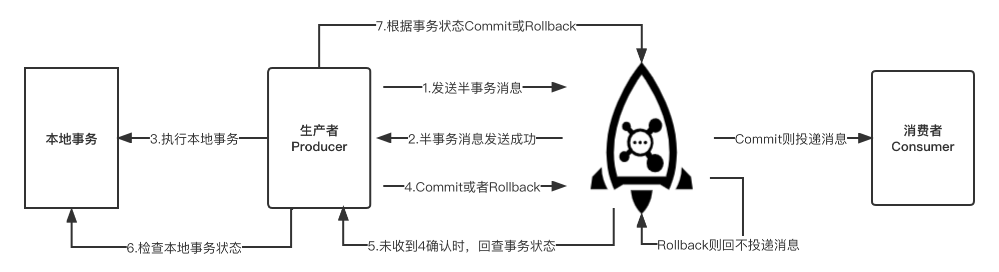

# 事务消息

事务消息是 Apache RocketMQ 提供的一种高级消息类型，支持在分布式场景下保障消息生产和本地事务的最终一致性。

事务消息的详细交互流程如下图所示：

## 事务消息步骤

事务消息发送步骤如下：

1. 生产者将半事务消息发送至 RocketMQ Broker。
2. RocketMQ Broker 将消息持久化成功之后，向生产者返回 Ack 确认消息已经发送成功，此时消息暂不能投递，为半事务消息。
3. 生产者开始执行本地事务逻辑。
4. 生产者根据本地事务执行结果向服务端提交二次确认结果（Commit或是Rollback），服务端收到确认结果后处理逻辑如下：

* 二次确认结果为Commit：服务端将半事务消息标记为可投递，并投递给消费者。
* 二次确认结果为Rollback：服务端将回滚事务，不会将半事务消息投递给消费者。
 
5. 在断网或者是生产者应用重启的特殊情况下，若服务端未收到发送者提交的二次确认结果，或服务端收到的二次确认结果为Unknown未知状态，经过固定时间后，服务端将对消息生产者即生产者集群中任一生产者实例发起消息回查。

6. :::note 需要注意的是，服务端仅仅会按照参数尝试指定次数，超过次数后事务会强制回滚，因此未决事务的回查时效性非常关键，需要按照业务的实际风险来设置 :::

事务消息回查步骤如下： 

7. 生产者收到消息回查后，需要检查对应消息的本地事务执行的最终结果。

8. 生产者根据检查得到的本地事务的最终状态再次提交二次确认，服务端仍按照步骤4对半事务消息进行处理。
