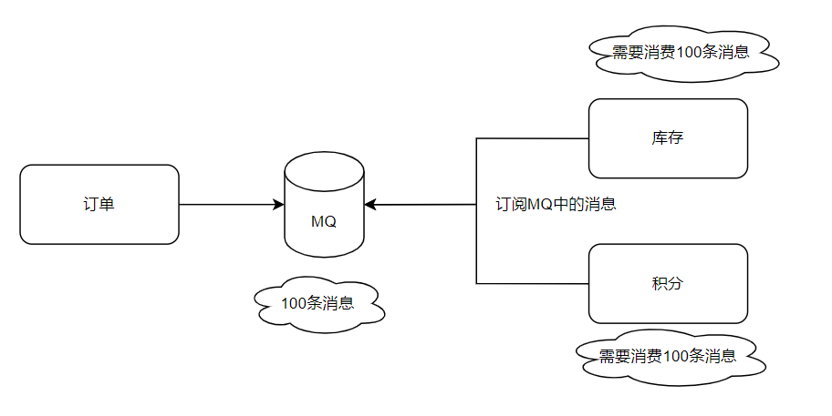

# 多个消费组消费同一个topic

在RocketMQ中，一个topic可以被多个消费组（consumer group）订阅。多个消费组可以同时消费同一个topic的消息，每个消费组内部的消费者可以独立地消费消息。

## 原理如下：

1. 消息存储：RocketMQ将所有的消息持久化存储在Broker节点上。每个Broker都维护着一个commit log，用于存储消息。
2. 消费组：当一个新的消费组启动时，它需要向Broker注册，并创建一个唯一的Group ID。这个Group ID用于标识这个消费组。
3. Topic订阅：在消费组创建之后，需要在该消费组中的每个消费者实例上订阅感兴趣的topic。订阅关系会保存在Broker端。
4. 消息分发：当消息发送到Broker后，Broker会根据消费组的订阅关系，将消息推送给所有订阅了该topic的消费组。
5. 消费进度管理：每个消费者实例在消费消息时，会保存自己的消费进度（offset）。这样，在下次启动时，可以从上次消费的位置继续进行消费。
6. 消息负载均衡：RocketMQ会根据消费组的订阅关系和消费进度，动态地将消息分发给消费组中的消费者实例。通过负载均衡算法，确保每个消费者实例能够平均地消费消息。

总结来说，RocketMQ实现多个消费组消费同一topic的原理是通过订阅关系、消息分发和消费进度管理来实现的。这样可以实现消息的并行消费，提高系统的吞吐量和可伸缩性。

## RocketMQ同一topic，不同消费组，是存了多份消息吗

RocketMQ是一种分布式消息中间件，它采用了发布-订阅模式来处理消息。在RocketMQ中，一个topic可以有多个消费组，每个消费组可以有多个消费者实例。当不同的消费组订阅同一个topic时，RocketMQ会为每个消费组保存一份消息。

这意味着，对于同一个topic的消息，不同的消费组可以独立消费，并且每个消费组都会收到完整的消息副本。这种设计方式可以实现消息的并行消费和负载均衡，确保每个消费组都可以按照自己的速度独立地消费消息。同时，由于消息的复制和存储采用了主从同步的方式，即使某个Broker节点出现故障，消息也可以从其他节点中恢复。

需要注意的是，不同消费组之间的消费进度是独立的，一个消费组的消费进度不会影响其他消费组。这样可以确保每个消费组都可以按照自己的需求和进度进行消息消费。

## RocketMQ同一消费组消费完成后，消息会删除吗
RocketMQ在同一消费组消费完成后，默认情况下不会立即删除消息。消息删除的具体行为取决于消息的消费模式和消息的确认方式。

对于集群消费模式，消息将在被消费者集群中的所有消费者都消费完成后，才会被标记为已删除。这意味着只有当所有消费者都成功消费并确认了消息后，消息才会被删除。

对于广播消费模式，消息将在被任何一个消费者成功消费并确认后，立即被标记为已删除。因此，在广播模式下，消息只需要被任意一个消费者成功处理即可删除。

需要注意的是，RocketMQ提供了多种消息确认方式，包括自动确认和手动确认。如果使用手动确认方式，在消息被处理后，需要显式地调用确认方法来通知RocketMQ该消息已经成功处理。只有在消息被确认后，RocketMQ才会将其标记为已删除。

综上所述，RocketMQ同一消费组消费完成后，默认情况下消息不会立即删除，而是根据消费模式和确认方式的不同来确定消息删除的时机。

 
 

如下场景：

当其中一个消费者消费时出现异常会重试消费。