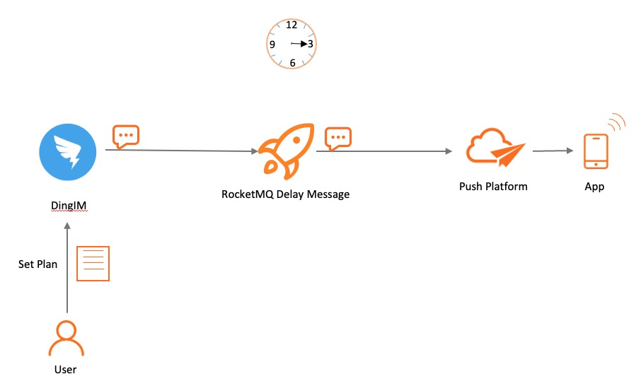
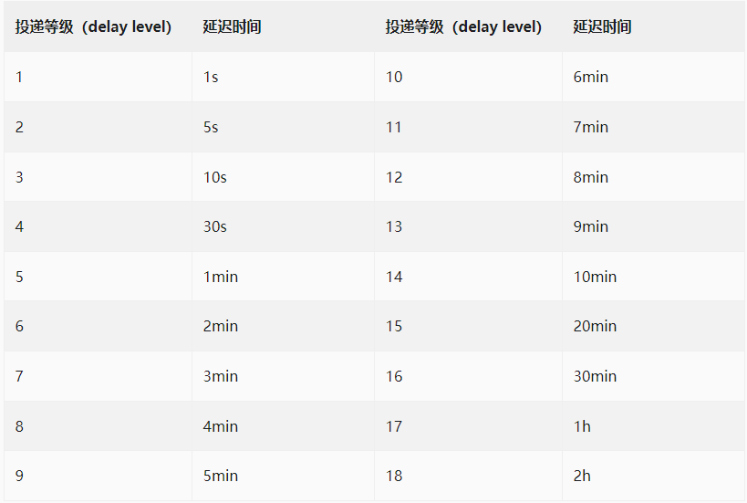

# 定时/延时消息

> 定时消息和延时消息本质相同，都是服务端根据消息设置的定时时间在某一固定时刻将消息投递给消费者消费。因此，下文统一用定时消息描述。

## 什么是定时消息

定时消息是 Apache RocketMQ 提供的一种高级消息类型，消息被发送至服务端后，在指定时间后才能被消费者消费。通过设置一定的定时时间可以实现分布式场景的延时调度触发效果。

## 什么是延时消息

延迟消息发送是指消息发送到Apache RocketMQ后，并不期望立马投递这条消息，而是延迟一定时间后才投递到Consumer进行消费。

在分布式定时调度触发、任务超时处理等场景，需要实现精准、可靠的延时事件触发。使用 RocketMQ 的延时消息可以简化定时调度任务的开发逻辑，实现高性能、可扩展、高可靠的定时触发能力。

 
 

## 延时消息约束

Apache RocketMQ 一共支持18个等级的延迟投递，具体时间如下：

 
 

## 应用场景

在分布式定时调度触发、任务超时处理等场景，需要实现精准、可靠的定时事件触发。使用 Apache RocketMQ 的定时消息可以简化定时调度任务的开发逻辑，实现高性能、可扩展、高可靠的定时触发能力。

**典型场景**

* 分布式定时调度
* 任务超时处理

 
 

## 基于定时消息的超时任务处理具备如下优势：

* 精度高、开发门槛低：基于消息通知方式不存在定时阶梯间隔。可以轻松实现任意精度事件触发，无需业务去重。
* 高性能可扩展：传统的数据库扫描方式较为复杂，需要频繁调用接口扫描，容易产生性能瓶颈。 Apache RocketMQ 的定时消息具有高并发和水平扩展的能力。

 
 

## 功能原理

**定时时间设置原则**

* Apache RocketMQ 定时消息设置的定时时间是一个预期触发的系统时间戳，延时时间也需要转换成当前系统时间后的某一个时间戳，而不是一段延时时长。
* 定时时间的格式为毫秒级的Unix时间戳，您需要将要设置的时刻转换成时间戳形式。
* 定时时间必须设置在定时时长范围内，超过范围则定时不生效，服务端会立即投递消息。
* 定时时长最大值默认为24小时，不支持自定义修改，更多信息，请参见参数限制。
* 定时时间必须设置为当前时间之后，若设置到当前时间之前，则定时不生效，服务端会立即投递消息。

 
 

## 使用限制

### 消息类型一致性

定时消息仅支持在 MessageType为Delay 的主题内使用，即定时消息只能发送至类型为定时消息的主题中，发送的消息的类型必须和主题的类型一致。

 

### 定时精度约束

Apache RocketMQ 定时消息的定时时长参数精确到毫秒级，但是默认精度为1000ms，即定时消息为秒级精度。

Apache RocketMQ 定时消息的状态支持持久化存储，系统由于故障重启后，仍支持按照原来设置的定时时间触发消息投递。若存储系统异常重启，可能会导致定时消息投递出现一定延迟。

