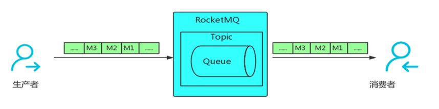
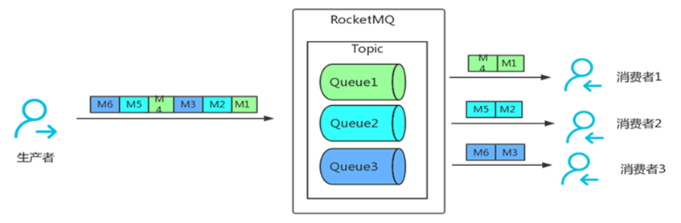
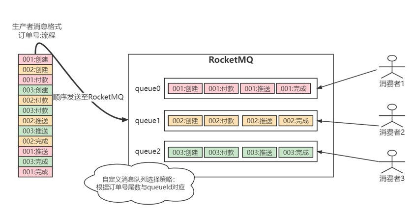
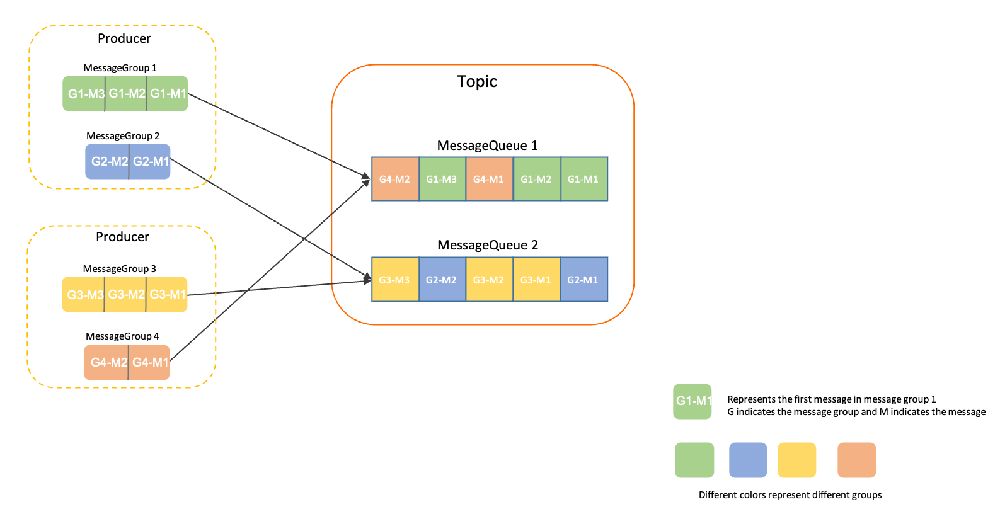

# 顺序消息

顺序消息是指消息的消费顺序和产生顺序相同。RocketMQ可以严格的保证消息有序，可以分为分区有序或者全局有序。区别如下：

生产消息时在默认的情况下消息发送会采取Round Robin轮询方式把消息发送到不同的queue(分区队列)；而消费消息的时候从多个queue上拉取消息，这种情况发送和消费是不能保证顺序。但是如果控制发送的顺序消息只依次发送到同一个queue中，消费的时候只从这个queue上依次拉取，则就保证了顺序。当发送和消费参与的queue只有一个，则是全局有序；如果多个queue参与，则为分区有序，即相对每个queue，消息都是有序的。

顺序消息分为全局顺序消息和部分顺序消息 :
* 全局顺序消息指某个 Topic 下的所有消息都要保证顺序；
* 部分顺序消息只要保证每一组消息被顺序消费即可，比如订单消息，只要保证同一个订单 ID 个消息能按顺序消费即可。

## 全局顺序消息

全局有序比较简单，主要控制在于创建Topic指定只有一个队列，同步确保生产者与消费者都只有一个实例进行即可。为了保证整个 Topic 全局消息有序，只能消除所有的并发处理，各部分都设置成单线程处理 ，这时候就完全牺牲 RocketMQ 的高并发、高吞吐的特性了。

## 部分顺序消息

部分顺序消息相对比较好实现，生产端需要做到把同 ID 的消息发送到同一个 Message Queue ；在消费过程中，要做到从同一个 Message Queue 读取的消息顺序处理——消费端不能并发处理顺序消息，这样才能达到部分有序。

在电商业务场景中，一个订单的流程是：创建、付款、推送、完成。在加入RocketMQ后，一个订单会分别产生对于这个订单的创建、付款、推送、完成等消息，如果我们把所有消息全部送入到RocketMQ中的一个主题中，这里该如何实现针对一个订单的消息顺序性呢！如下图：

要完成分区有序性，在生产者环节使用自定义的消息队列选择策略，确保订单号尾数相同的消息会被先后发送到同一个队列中(案例中主题有3个队列，生产环境中可设定成10个满足全部尾数的需求)，然后再消费端开启负载均衡模式，最终确保一个消费者拿到的消息对于一个订单来说是有序的。

## 如何保证消息的顺序性

Apache RocketMQ 的消息的顺序性分为两部分，生产顺序性和消费顺序性。

### 生产顺序性

Apache RocketMQ 通过生产者和服务端的协议保障单个生产者串行地发送消息，并按序存储和持久化。

如需保证消息生产的顺序性，则必须满足以下条件：

* 单一生产者：消息生产的顺序性仅支持单一生产者，不同生产者分布在不同的系统，即使设置相同的消息组，不同生产者之间产生的消息也无法判定其先后顺序。
* 串行发送：Apache RocketMQ 生产者客户端支持多线程安全访问，但如果生产者使用多线程并行发送，则不同线程间产生的消息将无法判定其先后顺序。

满足以上条件的生产者，将顺序消息发送至 Apache RocketMQ 后，会保证设置了同一消息组的消息，按照发送顺序存储在同一队列中。服务端顺序存储逻辑如下：

* 相同消息组的消息按照先后顺序被存储在同一个队列。
* 不同消息组的消息可以混合在同一个队列中，且不保证连续。

如上图所示，消息组1和消息组4的消息混合存储在队列1中， Apache RocketMQ 保证消息组1中的消息G1-M1、G1-M2、G1-M3是按发送顺序存储，且消息组4的消息G4-M1、G4-M2也是按顺序存储，但消息组1和消息组4中的消息不涉及顺序关系。

### 消费顺序性

Apache RocketMQ 通过消费者和服务端的协议保障消息消费严格按照存储的先后顺序来处理。

如需保证消息消费的顺序性，则必须满足以下条件：

#### 投递顺序

Apache RocketMQ 通过客户端SDK和服务端通信协议保障消息按照服务端存储顺序投递，但业务方消费消息时需要严格按照接收---处理---应答的语义处理消息，避免因异步处理导致消息乱序。

> 消费者类型为PushConsumer时， Apache RocketMQ 保证消息按照存储顺序一条一条投递给消费者，若消费者类型为SimpleConsumer，则消费者有可能一次拉取多条消息。此时，消息消费的顺序性需要由业务方自行保证。

#### 有限重试

Apache RocketMQ 顺序消息投递仅在重试次数限定范围内，即一条消息如果一直重试失败，超过最大重试次数后将不再重试，跳过这条消息消费，不会一直阻塞后续消息处理。

对于需要严格保证消费顺序的场景，请务设置合理的重试次数，避免参数不合理导致消息乱序。

## 生产顺序性和消费顺序性组合

如果消息需要严格按照先进先出（FIFO）的原则处理，即先发送的先消费、后发送的后消费，则必须要同时满足生产顺序性和消费顺序性。

一般业务场景下，同一个生产者可能对接多个下游消费者，不一定所有的消费者业务都需要顺序消费，您可以将生产顺序性和消费顺序性进行差异化组合，应用于不同的业务场景。例如发送顺序消息，但使用非顺序的并发消费方式来提高吞吐能力。更多组合方式如下表所示：

## 使用限制

顺序消息仅支持使用MessageType为FIFO的主题，即顺序消息只能发送至类型为顺序消息的主题中，发送的消息的类型必须和主题的类型一致。

