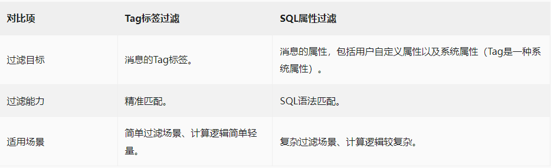

# 消息过滤 - Tag 消息

## 消息过滤定义

过滤的含义指的是将符合条件的消息投递给消费者，而不是将匹配到的消息过滤掉。

Apache RocketMQ 的消息过滤功能通过生产者和消费者对消息的属性、标签进行定义，并在 Apache RocketMQ 服务端根据过滤条件进行筛选匹配，将符合条件的消息投递给消费者进行消费。

 
 

## 应用场景

Apache RocketMQ 作为发布订阅模型的消息中间件广泛应用于上下游业务集成场景。在实际业务场景中，同一个主题下的消息往往会被多个不同的下游业务方处理，各下游的处理逻辑不同，只关注自身逻辑需要的消息子集。

使用 Apache RocketMQ 的消息过滤功能，可以帮助消费者更高效地过滤自己需要的消息集合，避免大量无效消息投递给消费者，降低下游系统处理压力。

Apache RocketMQ 主要解决的单个业务域即同一个主题内不同消息子集的过滤问题，一般是基于同一业务下更具体的分类进行过滤匹配。如果是需要对不同业务域的消息进行拆分，建议使用不同主题处理不同业务域的消息。

 
 

## 消息过滤原理

消息过滤主要通过以下几个关键流程实现：

* 生产者：生产者在初始化消息时预先为消息设置一些属性和标签，用于后续消费时指定过滤目标。
* 消费者：消费者在初始化及后续消费流程中通过调用订阅关系注册接口，向服务端上报需要订阅指定主题的哪些消息，即过滤条件。
* 服务端：消费者获取消息时会触发服务端的动态过滤计算，Apache RocketMQ 服务端根据消费者上报的过滤条件的表达式进行匹配，并将符合条件的消息投递给消费者。

 
 

## 消息过滤分类

Apache RocketMQ 支持Tag标签过滤和SQL属性过滤，这两种过滤方式对比如下：

 
 

## Tag标签过滤

Tag标签过滤方式是 Apache RocketMQ 提供的基础消息过滤能力，基于生产者为消息设置的Tag标签进行匹配。生产者在发送消息时，设置消息的Tag标签，消费者需指定已有的Tag标签来进行匹配订阅。

场景示例

以下图电商交易场景为例，从客户下单到收到商品这一过程会生产一系列消息：

* 订单消息
* 支付消息
* 物流消息

这些消息会发送到名称为Trade_Topic的Topic中，被各个不同的下游系统所订阅：

* 支付系统：只需订阅支付消息。
* 物流系统：只需订阅物流消息。
* 交易成功率分析系统：需订阅订单和支付消息。
* 实时计算系统：需要订阅所有和交易相关的消息。

 

### Tag标签设置

* Tag由生产者发送消息时设置，每条消息允许设置一个Tag标签。
* Tag使用可见字符，建议长度不超过128字符。

 

### Tag标签过滤规则

Tag标签过滤为精准字符串匹配，过滤规则设置格式如下：

* 单Tag匹配：过滤表达式为目标Tag。表示只有消息标签为指定目标Tag的消息符合匹配条件，会被发送给消费者。
* 多Tag匹配：多个Tag之间为或的关系，不同Tag间使用两个竖线（||）隔开。例如，Tag1||Tag2||Tag3，表示标签为Tag1或Tag2或Tag3的消息都满足匹配条件，都会被发送给消费者进行消费。
* 全部匹配：使用星号（*）作为全匹配表达式。表示主题下的所有消息都将被发送给消费者进行消费。

 
 

## 优缺点

**优点：** 仅仅根据ConsumeQueue就可以进行过滤，过滤完之后才去CommitLog拉取实际的消息内容返回给消费者，效率比较高。

**缺点：** 消费者端需要做进一步的比对才可以确定是否是感兴趣的消息。