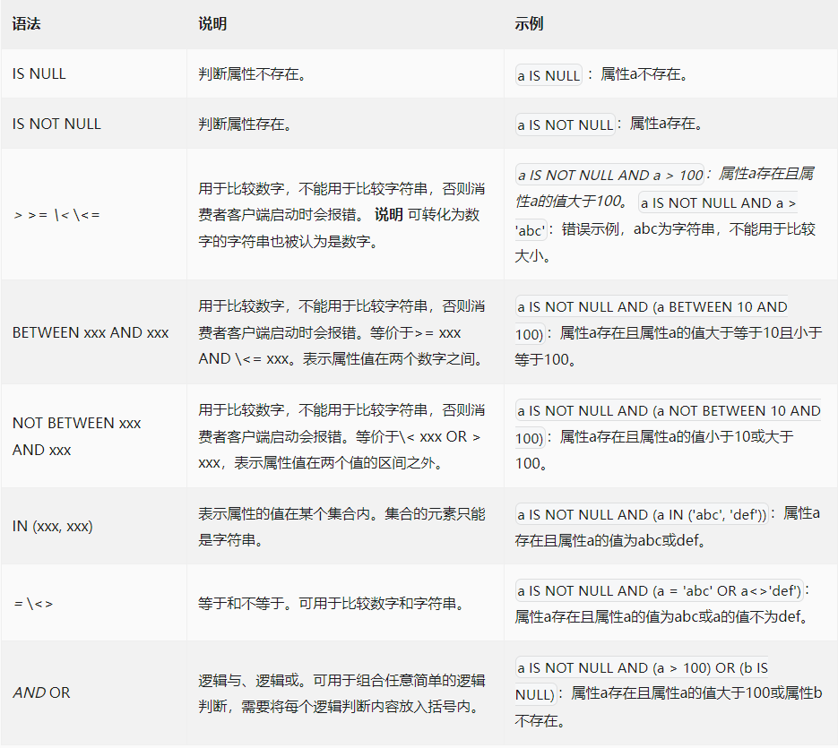

# 消息过滤 - SQL 消息

SQL属性过滤是 Apache RocketMQ 提供的高级消息过滤方式，通过生产者为消息设置的属性（Key）及属性值（Value）进行匹配。生产者在发送消息时可设置多个属性，消费者订阅时可设置SQL语法的过滤表达式过滤多个属性。

**场景示例**

以下图电商交易场景为例，从客户下单到收到商品这一过程会生产一系列消息，按照类型将消息分为订单消息和物流消息，其中给物流消息定义地域属性，按照地域分为杭州和上海：

* 订单消息
 
* 物流消息

 - 物流消息且地域为杭州
 - 物流消息且地域为上海

这些消息会发送到名称为Trade_Topic的Topic中，被各个不同的系统所订阅：

* 物流系统1：只需订阅物流消息且消息地域为杭州。
* 物流系统2：只需订阅物流消息且消息地域为杭州或上海。
* 订单跟踪系统：只需订阅订单消息。
* 实时计算系统：需要订阅所有和交易相关的消息。

 
 

## 消息属性设置

生产者发送消息时可以自定义消息属性，每个属性都是一个自定义的键值对（Key-Value）。

每条消息支持设置多个属性。

 
 

## SQL属性过滤规则

RocketMQ的SQL表达式语法 只定义了一些基本的语法功能。

**数字比较：** >，>=，<，<=，BETWEEN，=

**字符比较：** =，<>，IN，IS NULL，or，IS NOT NULL

**逻辑运算符：** AND, OR, NOT

常量类型:

* 数值，如：123, 3.1415
* 字符, 如：‘abc’, 必须使用单引号
* NULL，特殊常量
* Boolean, TRUE or FALSE

SQL属性过滤使用SQL92语法作为过滤规则表达式，语法规范如下：

由于SQL属性过滤是生产者定义消息属性，消费者设置SQL过滤条件，因此过滤条件的计算结果具有不确定性，服务端的处理方式如下：

* 异常情况处理：如果过滤条件的表达式计算抛异常，消息默认被过滤，不会被投递给消费者。例如比较数字和非数字类型的值。
* 空值情况处理：如果过滤条件的表达式计算值为null或不是布尔类型（true和false），则消息默认被过滤，不会被投递给消费者。例如发送消息时未定义某个属性，在订阅时过滤条件中直接使用该属性，则过滤条件的表达式计算结果为null。
* 数值类型不符处理：如果消息自定义属性为浮点型，但过滤条件中使用整数进行判断，则消息默认被过滤，不会被投递给消费者。

 
 

## 使用建议

从消息的过滤机制和主题的原理机制可以看出，业务消息的拆分可以基于主题进行筛选，也可以基于主题内消息的Tag标签及属性进行筛选。关于拆分方式的选择，应遵循以下原则：

* 消息类型是否一致：不同类型的消息，如顺序消息和普通消息需要使用不同的主题进行拆分，无法通过Tag标签进行分类。
* 业务域是否相同：不同业务域和部门的消息应该拆分不同的主题。例如物流消息和支付消息应该使用两个不同的主题；同样是一个主题内的物流消息，普通物流消息和加急物流消息则可以通过不同的Tag进行区分。
* 消息量级和重要性是否一致：如果消息的量级规模存在巨大差异，或者说消息的链路重要程度存在差异，则应该使用不同的主题进行隔离拆分。

 
 

## 优缺点

优点：可以设置多个自定义属性值，过滤可以做到多样化。并且属性值直接比较可以确保返回的消息都是消费者感兴趣的消息。

缺点：仍然需要遍历Topic下的所有消息，判断是否匹配属性表达式，有一定的开销。

 
 

## 注意：

> 默认情况下broke没有开启对SQL语法的支持，需要修改配置

- sql92过滤仅对push消费方式生效。

- 要使用SQL92标准过滤消息，首先需要开启enablePropertyFilter，该属性默认为false。

修改\conf\broker.conf配置文件，末尾处增加enablePropertyFilter=true
重启Broker

- SQL92底层使用布隆过滤器进行过滤。
