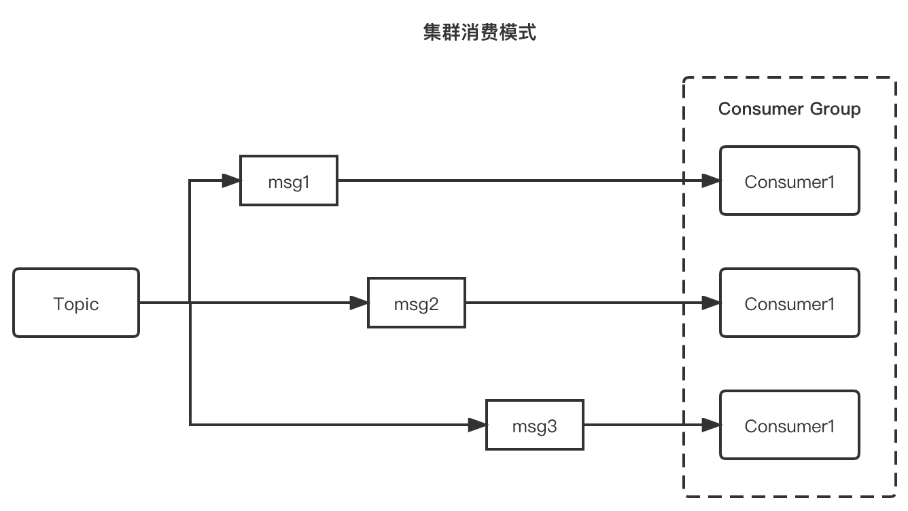
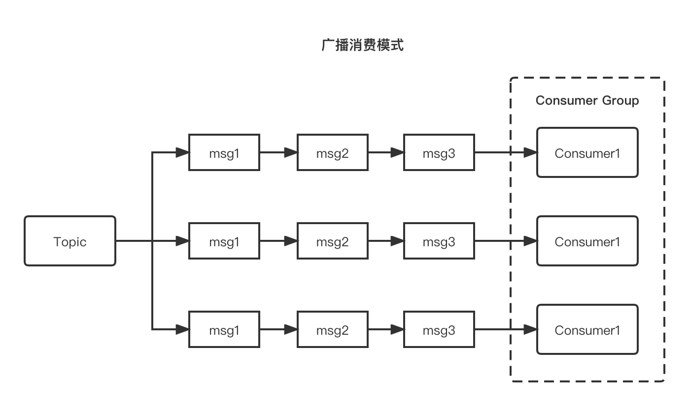

# 集群消费和广播消费（主要广播消息）

在消费者中消费组的有非常重要的作用，如果多个消费者设置了相同的Consumer Group，我们认为这些消费者在同一个消费组内。 

在 Apache RocketMQ 有两种消费模式，分别是：

* 集群消费模式：当使用集群消费模式时，RocketMQ 认为任意一条消息只需要被消费组内的任意一个消费者处理即可。
* 广播消费模式：当使用广播消费模式时，RocketMQ 会将每条消息推送给消费组所有的消费者，保证消息至少被每个消费者消费一次。

## 集群消费模式

适用于每条消息只需要被处理一次的场景，也就是说整个消费组会Topic收到全量的消息，而消费组内的消费分担消费这些消息，因此可以通过扩缩消费者数量，来提升或降低消费能力，具体示例如下图所示，是最常见的消费方式。

## 广播消费模式

适用于每条消息需要被消费组的每个消费者处理的场景，也就是说消费组内的每个消费者都会收到订阅Topic的全量消息，因此即使扩缩消费者数量也无法提升或降低消费能力，具体示例如下图所示。

 

> 注意：

如果使用广播消费模式，当其中一个消费者消费异常时，不会重试。